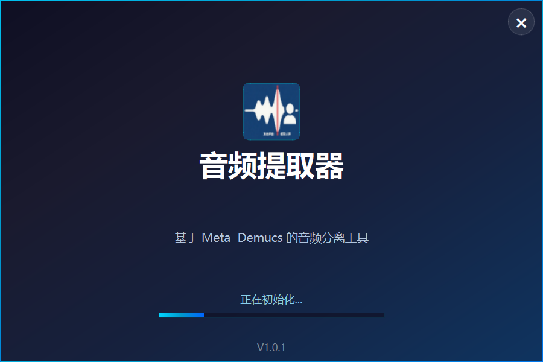
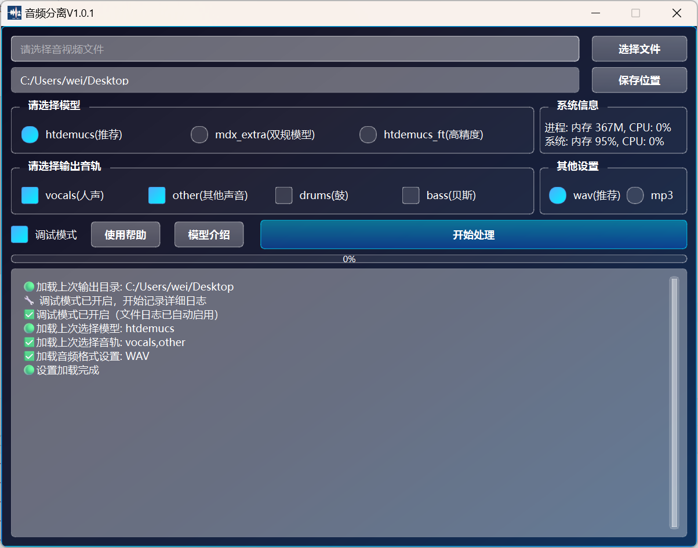

🎵 项目使用说明（音频分离工具 Demucs GUI）
<h3>本工具基于 Facebook AI Research 开源模型 <a href="https://github.com/facebookresearch/demucs">Demucs</a> 封装，遵循 MIT License。</h3>
1️⃣ 模型文件下载

首次使用前，请下载 Demucs 模型文件（.th 格式）：

🔗 官方地址：
👉 https://github.com/facebookresearch/demucs

🇨🇳 国内下载（推荐）：
📦 百度网盘(含exe)：https://pan.baidu.com/s/1xfurcZC4Ctv3CDUNLBiQ5A?pwd=3sb5  提取码: 3sb5

2️⃣ 模型文件放置说明

请将下载的模型文件（.th）放置于程序目录下的 models 文件夹；

若 models 文件夹不存在，程序将自动创建；

模型文件命名需保持原始格式，例如：htdemucs.th, htdemucs_ft.th 等。

3️⃣ 启动程序

双击运行 音频分离工具.exe（首次启动可能略慢，属正常现象）；

程序为 离线独立运行包，无需联网即可使用；

支持 Windows 10 及以上版本。

4️⃣ 功能说明

🎶 音轨分离

支持从音乐/音频文件中分离出多个音轨（人声、人声伴奏、鼓点、贝斯等）；

支持多种音视频格式：.mp3, .wav, .flac, .mp4, .mov 等。

📤 输出选项

输出为高质量 .wav 或 .flac 文件；

支持 int16 与 float32 精度（可选）；

🖥 界面特性

文件选择 & 输出目录选择；

分离进度实时显示；

日志窗口输出详细状态；

可选调试模式，方便排查错误。

5️⃣ 使用说明与免责声明

本项目基于 Facebook AI 开源模型 Demucs 开发；

本软件为个人开发工具，仅收取服务费用；

⚠️ 严禁用于一切非法用途，开发者不对任何使用结果或法律风险承担责任；

请勿用于盗版传播、隐私窃取、违法活动等用途。

⚠️ 注意事项

⏳ 首次启动可能较慢，请耐心等待模型初始化；
💾 请确保有足够的磁盘空间存放分离出的音轨文件；
🧠 建议使用 64 位操作系统并预留充足内存（模型运算需消耗较大内存）；
🛠 如果遇到问题，可开启调试模式查看详细日志；
📥 分离结果默认保存在 demucs_output 文件夹中，命名规则为：
output_vocals.wav, output_drums.wav 等。

界面截图:

如有帮助, 谢谢打赏

